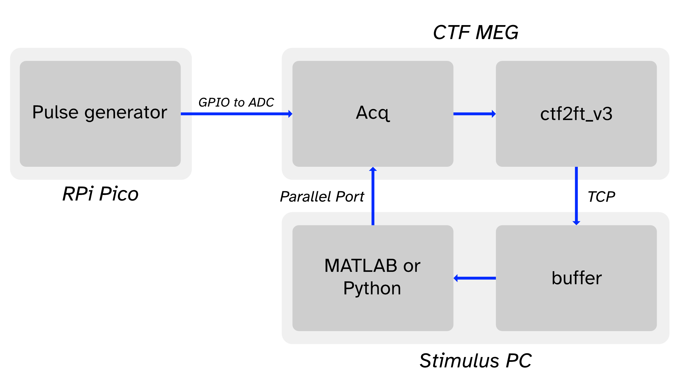
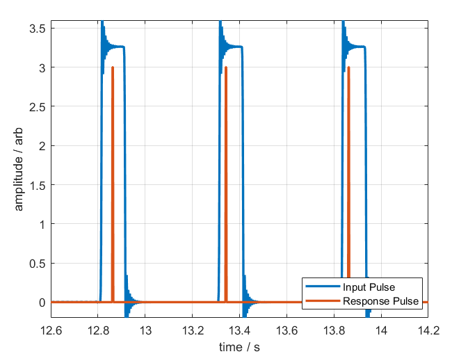
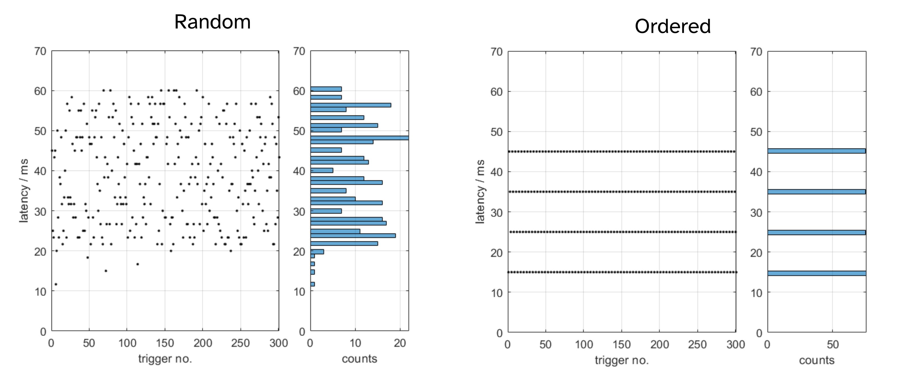
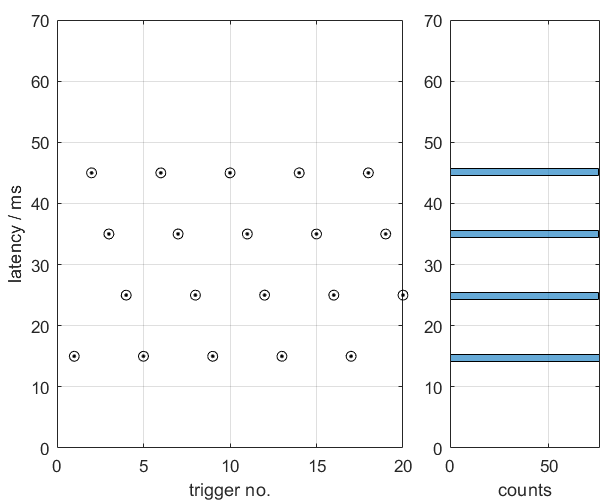

# CTF Realtime Latency Findings

## Summary (tl;dr)

> - Using the realtime code from Fieldtrip for the CTF system we **manage a minimum latency  of ~20 ms** from a simulated neural feature being generated to being digitised by the CTF  system, and then subsequently detected by our realtime detector.
>
> - However, it appears there is a robust **uniform distribution of latencies 40 ms wide**, so a maximal latency of ~60 ms is equally as likely.
>
> - This 40 ms variability does not appear to be altered by the sample rate of the MEG or the number of channels sent from the MEG to the stim PC, implying this might be **a fundamental feature of how the CTF system releases data into the shared memory segment**.

### Unanswered questions

1) Does the version of Acq we use only hand over data every 40 ms?
2) If not is this something in the FieldTrip `ctf2ft_v3` or `buffer` implementations  which is introducing this behaviour?

## MEG Information

|   |   |
|---|---|
|**Scanner type**| 275 channel CTF |
| **Electronics Type** | DSQ-3500 |
| **ACQ version** | 6.1.14_beta  |

## Experimental setup

We are using an altered version of the [flank detection task](https://www.fieldtriptoolbox.org/example/measuring_the_timing_delay_and_jitter_for_a_real-time_application/) on the FieldTrip website. Our version can be found at the [bottom of the page](#flank-code). In summary:

- A Raspberry Pi Pico micro-controller to generates a 100 ms wide pulse on one of the GPIO pins, which is fed into the CTF MEG electronics from one of the front-panel ADC ports. 
- The data from the CTF system is sent over the network; from the Acquisition PC using the executable `ctf2ft_v3` [link to source](https://github.com/fieldtrip/fieldtrip/blob/master/realtime/src/acquisition/ctf/ctf2ft_v3.c) to the Stim PC using the executable `buffer.exe` available in FieldTrip.
- MATLAB or Python scripts on the Stim PC reads the local buffer and performs a rising edge detection on the ADC channel of interest. Upon a successful detection a parallel port trigger is sent back to the CTF system for offline analysis.

A block diagram of the setup is below

<p align="center">
    
</p>

### Initial experiment

- CTF system was set to 600 Hz sampling rate, no head localisation, only a single channel (`UADC013`) was sent between the machines.
- There were two modes of pulse generation tested:
    1. **Random:** 100 ms pulse with a 350-1000 ms jittered interval after pulse offset.
    2. **Ordered:** 100 ms pulse with 350 ms interval after pulse offset.
- Data was recorded for each mode, 300 responses were collected and the latency between the initial pulse and parallel port trigger were analysed.

> :computer: **Fieldtrip code note:** The execution time of the code varied quite  depending on the language/method of communicating with the buffer. Here the timing refers to the time it takes to determine if any new data is in the buffer, read the last 200 ms of data, detect a rising edge and send a pulse 1ms wide. 

|  Language | Buffer Call Method | Avg. Execution time |
|---|---|---|
| MATLAB | `ft_read_header`/`ft_read_data` | 14 ms |
| MATLAB | `buffer.mex*` | 4 ms |
| Python | [`FieldTrip.py` link for code](https://github.com/fieldtrip/fieldtrip/blob/master/realtime/src/buffer/python/FieldTrip.py) | 2 ms |

**Note:**  Python can be set up the send the parallel port trigger as a threaded process, without halting the rest of the code, so in theory this time could be reduced further!

## Results


An example of the input signal from the microcontroller (blue) and the response trigger when this is detected (red) are shown below.

<p align="center">
    
</p>

Results from the two pulse generation methods shown below. The black dots represent the latencies for each individual trial whilst the right plot is a histogram showing how the latencies are distributed.

<p align="center">
    
</p>

- With the exception of 4 trials (???), latencies are between 20 ms and 60 ms for the Random interval mode.
- The ordered mode generated latencies at 4 specific times, 15 ms, 25 ms, 35 ms, and 45 ms. 
- Zooming in on the ordered mode latencies for the ordered mode shows it cycles through the latencies from worst to best before wrapping around again.

<p align="center">
    
</p>

### ctf2ft_v3 output

- The console output from `ctf2ft_v3` suggests that new packets data were being released from the CTF acquisition software every 40 ms _irrespective of the sample rate used_.

Below is the the command line output from `ctf2ft_v3` when a sample rate for 600 Hz was used, showing every 40 ms a packet is received.

```
600 Hz
Data |  24 samples | ID=216 | slot=216 | dT= 40.0  mT=40.0  sT= 0.0
Data |  24 samples | ID=217 | slot=217 | dT= 40.0  mT=40.0  sT= 0.0
Data |  24 samples | ID=218 | slot=218 | dT= 40.0  mT=40.0  sT= 0.0
Data |  24 samples | ID=219 | slot=219 | dT= 40.0  mT=40.0  sT= 0.0
```

**Note:** dT = time between received packets from Acq, mT is the mean time between packets, sT is the standard error (or deviation - will confirm).


#### Other sampling rates

At 1200 Hz, the number of samples handed over in one go doubles and the average time of 40 ms between packets received is maintained.

```
1200 Hz
Data |  48 samples | ID=507 | slot=507 | dT= 40.0  mT=40.0  sT= 6.0
Data |  48 samples | ID=508 | slot=508 | dT= 40.0  mT=40.0  sT= 6.0
Data |  48 samples | ID=509 | slot=509 | dT= 50.0  mT=40.0  sT= 6.0
Data |  48 samples | ID=510 | slot=510 | dT= 30.0  mT=40.0  sT= 6.0
```

> :computer: **Fieldtrip code note:** We noticed that the total memory for each ACQ packet is [overallocated by 4000 bytes](https://github.com/fieldtrip/fieldtrip/blob/466108925b3f0abaa2f44b38dbd8e35c2ab625d4/realtime/src/acquisition/ctf/ctf2ft_v3.c#L34) to overcome an issue where [too much data is sent in error](https://www.fieldtriptoolbox.org/development/realtime/ctf/#number-of-channels) on the older versions of Acq.. We reduced the overallocation size down to 0 and it reduced the standard deviation from **6.0 ms** to **0.5 ms**. No issues with segmentation faults after slot 600 occurred. All further console outputs are from this version of the code.

At 2400 Hz the number of samples per packet would remain at ~48 (see below), but would send two packets at a time.

```
2400 Hz
Data |  47 samples | ID=300 | slot=300 | dT=  0.0  mT=20.0  sT= 19.9
Data |  49 samples | ID=301 | slot=301 | dT= 40.0  mT=20.0  sT= 19.9
Data |  47 samples | ID=302 | slot=302 | dT=  0.0  mT=20.0  sT= 19.9
Data |  49 samples | ID=303 | slot=303 | dT= 40.0  mT=20.0  sT= 19.9
Data |  47 samples | ID=304 | slot=304 | dT=  0.0  mT=20.0  sT= 19.9
Data |  49 samples | ID=305 | slot=305 | dT= 40.0  mT=20.0  sT= 19.9
Data |  47 samples | ID=306 | slot=306 | dT=  0.0  mT=20.0  sT= 19.9
Data |  49 samples | ID=307 | slot=307 | dT= 40.0  mT=20.0  sT= 19.9
```

For higher frequencies the number of samples in a packet or the number of packets released at once continues to increase. 

**Note:** we also looked at whether decimating the data using the functionality built into `ctf2ft_v3` would change the 40 ms jitter, this did not.

```
6400 Hz
Data |  86 samples | ID=169 | slot=169 | dT= 40.0  mT=13.3  sT= 18.8
Data |  86 samples | ID=170 | slot=170 | dT=  0.0  mT=13.3  sT= 18.8
Data |  84 samples | ID=171 | slot=171 | dT=  0.0  mT=13.3  sT= 18.8
Data |  86 samples | ID=172 | slot=172 | dT= 39.9  mT=13.3  sT= 18.8
Data |  86 samples | ID=173 | slot=173 | dT=  0.0  mT=13.3  sT= 18.8
Data |  84 samples | ID=174 | slot=174 | dT=  0.0  mT=13.3  sT= 18.8
Data |  86 samples | ID=175 | slot=175 | dT= 40.0  mT=13.3  sT= 18.8
Data |  86 samples | ID=176 | slot=176 | dT=  0.0  mT=13.3  sT= 18.8
Data |  84 samples | ID=177 | slot=177 | dT=  0.0  mT=13.3  sT= 18.8
```

```
19200 Hz
Data |  86 samples | ID=361 | slot=361 | dT= 39.9  mT=13.3  sT= 12.5
Data |  86 samples | ID=362 | slot=362 | dT=  0.0  mT=13.3  sT= 12.5
Data |  86 samples | ID=363 | slot=363 | dT=  0.0  mT=13.3  sT= 12.5
Data |  86 samples | ID=364 | slot=364 | dT=  0.0  mT=13.3  sT= 12.5
Data |  86 samples | ID=365 | slot=365 | dT=  0.0  mT=13.3  sT= 12.5
Data |  86 samples | ID=366 | slot=366 | dT=  0.0  mT=13.3  sT= 12.5
Data |  86 samples | ID=367 | slot=367 | dT=  0.0  mT=13.3  sT= 12.5
Data |  86 samples | ID=368 | slot=368 | dT=  0.0  mT=13.3  sT= 12.5
Data |  80 samples | ID=369 | slot=369 | dT=  0.0  mT=13.3  sT= 12.5
Data |  86 samples | ID=370 | slot=370 | dT= 39.9  mT=13.3  sT= 12.5
Data |  86 samples | ID=371 | slot=371 | dT=  0.0  mT=13.3  sT= 12.5
Data |  86 samples | ID=372 | slot=372 | dT=  0.0  mT=13.3  sT= 12.5
Data |  86 samples | ID=373 | slot=373 | dT=  0.0  mT=13.3  sT= 12.5
Data |  86 samples | ID=374 | slot=374 | dT=  0.0  mT=13.3  sT= 12.5
Data |  86 samples | ID=375 | slot=375 | dT=  0.0  mT=13.3  sT= 12.5
Data |  86 samples | ID=376 | slot=376 | dT=  0.0  mT=13.3  sT= 12.5
Data |  86 samples | ID=377 | slot=377 | dT=  0.0  mT=13.3  sT= 12.5
Data |  80 samples | ID=378 | slot=378 | dT=  0.0  mT=13.3  sT= 12.5
```

### Flank Code

#### MATLAB - calling the buffer directly

```matlab

HOSTNAME = 'localhost'; % name of computer (leave as localhost)
PORT = 1972;            % port number (leave as 1972)
WINDOW = 0.2;           % how much of newest data to process (in seconds)
HOLD = 24;              % how many new samples before new data is read in
TOTHITS = 100;          % number of rising edges detected before quitting loop
CHANNEL = 'UADC013';    % which channel to detect rising edges on
THRESHOLD = 1;          % Which gradient are we expecting
DEADTIME = 0.2;         % Minimum time between events (in seconds)

%% Code runs below

% start by reading the header from the realtime buffer
hdr = buffer('get_hdr', [], HOSTNAME, PORT);

% define a subset of channels for reading from CHANNEL option
chanindx    = match_str(hdr.channel_names, CHANNEL);

% determine the size of blocks to process
overlap   = floor(WINDOW*hdr.fsample);

% determine how many samples the deadtime is
deadtime  = floor(DEADTIME*hdr.fsample);

% intialise variables for loop
oldSamples = 0;
hits = 0;
prev_hit = 0;
prevSample  = 0;


disp('waiting for first trigger!')
%%%%%%%%%%%%%%%%%%%%%%%%%%%%%%%%%%%%%%%%%%%%%%%%%%%%%%%%%%%%%%%%%%%%%%%%%%%
% this is the general BCI loop where realtime incoming data is handled
%%%%%%%%%%%%%%%%%%%%%%%%%%%%%%%%%%%%%%%%%%%%%%%%%%%%%%%%%%%%%%%%%%%%%%%%%%%
while hits < TOTHITS % have we found more than TOTHITS number of triggers?
 
    %%%%%%%%%%%%%%%%%%%%%%%%%%%%%%%%%%%%%%%%%%%%%%%%%%%%%%%%%%%%%%%%%%%%%%%
    % 1) at this part of the loop we are checking the header to see if 
    % enough new data has been put in the buffer before we read/process it,
    % saves us wasting time reprocessing old data
    %%%%%%%%%%%%%%%%%%%%%%%%%%%%%%%%%%%%%%%%%%%%%%%%%%%%%%%%%%%%%%%%%%%%%%%

    t0 = tic;
    hdr = buffer('get_hdr', [], HOSTNAME, PORT);

    newSamples = (hdr.nsamples);

    if newSamples - oldSamples >= HOLD % enough new samples!

        %%%%%%%%%%%%%%%%%%%%%%%%%%%%%%%%%%%%%%%%%%%%%%%%%%%%%%%%%%%%%%%%%%%
        % 2) if there was enough new data in the buffer, we want to read in
        % only the newest data. How much data is defined by the WINDOW
        % variable at the top of the script. Once read in the target
        % channel is differentiated and if the gradient is above a
        % threshold then we've detected a trigger event!
        %%%%%%%%%%%%%%%%%%%%%%%%%%%%%%%%%%%%%%%%%%%%%%%%%%%%%%%%%%%%%%%%%%%

        % determine the samples to process
        endSamples = newSamples;
        begSamples = endSamples - overlap;

        % read
        datstruct = buffer('get_dat', [begSamples endSamples]-1, HOSTNAME, PORT);
        dat = datstruct.buf;

        % differentiate data segment in trigger channel
        ddat = diff([dat(chanindx,1) dat(chanindx,:)]);

        % detect flanks in CHANNEL that are of certain size 
        idx = find(ddat >= THRESHOLD, 1, 'first');

        if ~isempty(idx) % found an event

            %%%%%%%%%%%%%%%%%%%%%%%%%%%%%%%%%%%%%%%%%%%%%%%%%%%%%%%%%%%%%%%
            % 3) If we have found a trigger we need to check its not come
            % so soon after the last one, incase we've accidentally 
            % detected the same event twice on multiple loop iterations
            %%%%%%%%%%%%%%%%%%%%%%%%%%%%%%%%%%%%%%%%%%%%%%%%%%%%%%%%%%%%%%%
            
            % work the true sample number when an event happen. 
            this_hit = begSamples + idx;

            if this_hit - prev_hit > deadtime % its not a repreat hit

                %%%%%%%%%%%%%%%%%%%%%%%%%%%%%%%%%%%%%%%%%%%%%%%%%%%%%%%%%%%
                % 4) At this point we would send a trigger in the real code
                % but this has been removed from this example.
                %%%%%%%%%%%%%%%%%%%%%%%%%%%%%%%%%%%%%%%%%%%%%%%%%%%%%%%%%%%
                
                % send_trigger()

                dS = this_hit - prev_hit;
                dT = toc(t0) * 1000;
                hits = hits + 1;

                fprintf('Flank: %03i/%03i | dS: %04i samples | dT: %.3f s | Loop Time : %.2f ms\n',...
                    hits, TOTHITS, dS, dS/hdr.fsample, dT);
                
                % Update when the 'last' event occured
                oldSamples = newSamples;
                prev_hit = this_hit;
            
            end

        end 
    else
        % if there wasn't enough new data, wait about a millisecond before
        % checking again.
        pause(0.001)
    end
end 

disp('END')

```

#### Python implementation

```python

import FieldTrip
import time
from numpy import argmax, floor, hstack, diff


def flank_test():
    
    HOSTNAME = 'localhost'
    PORT = 1972
    WINDOW = 0.2 # seconds
    HOLD = 24 # samples
    TOTHITS = 300
    THRESH = 1
    CHANNEL = 'UADC013'
    DEADTIME = 0.2
    
    oldSamples = 0 
    hits = 0
    
    prev_hit = 0
    
    ftc = FieldTrip.Client()
    
    print('Trying to connect to buffer on %s:%i ...' % (HOSTNAME, PORT))
    ftc.connect(HOSTNAME, PORT)
    
    print('Reading header ...')
    H = ftc.getHeader()
    
    deadsamples = int(floor(H.fSample * DEADTIME))
    wind = int(floor(H.fSample * WINDOW))
    
    cid = H.labels.index(CHANNEL)
    
    print('Waiting for first event ...')
    while hits <= TOTHITS: # main loop
        
        tic = time.time()
        newSamples = ftc.poll()[0]
        
        if newSamples - oldSamples >= HOLD: # enough new data
                   
            endSamples = newSamples - 1    
            begSamples = endSamples - wind + 1
            
            dat = ftc.getData([begSamples, endSamples])[:,cid]
            ddat = diff(hstack((dat[0], dat)))
            
            idx = argmax(ddat >= THRESH)
            
            if idx > 0: # found an event
            
                this_hit = begSamples + idx
            
                if this_hit - prev_hit > deadsamples: # its not a repeat hit
                
                    dS = this_hit - prev_hit
                    dT = (time.time() - tic) * 1000
                    hits += 1
                    
                    print('Flank: %03i/%03i | dS: %04i samples | dT: %.3f s | Loop Time : %.2f ms' % (hits, TOTHITS, dS, dS/H.fSample, dT))
                    
                    oldSamples = newSamples
                    prev_hit = this_hit

                    
                    
    ftc.disconnect()
    
    print('\nDisconnected')
    
flank_test()
```
