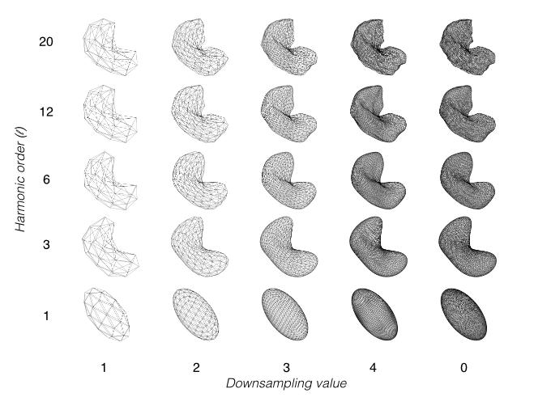
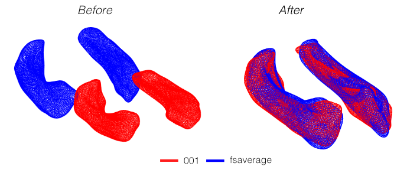
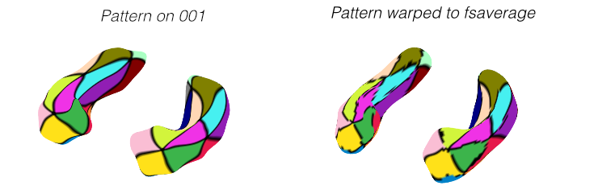

# OPMsurfer - Subcortical tools

An experimental method of extracting subcortical meshes, smoothing and registering them using spherical harmonic (SPHARM) decompositions, it *kind of* works.

## Requirements
- A linux/wsl distribution
- Freesurfer v5 or above (https://surfer.nmr.mgh.harvard.edu/fswiki/DownloadAndInstall)
- python3 
- MATLAB + SPM12
- **OPTIONAL:** spharm-pdm (linux binaries are provided here and the code should attempt to add to path). 

## Instructions 
### Setting up the environment
Assuming Freesurfer has been installed correctly on your device you need to add the correct paths to the environment, we need the `FREESURFER_HOME` and `SUBJECTS_DIR` to be set beforehand. Either add this to your `.bashrc` file or type the following commands into the command line:

```bash
export FREESURFER_HOME = /path/to/freesurfer
export SUBJECTS_DIR = /path/to/subjects_dir
source $FREESURFER_HOME/SetUpFreeSurfer.sh
```
**Optional:** You may want to permenantly install the spharm-pdm binaries somwhere permenant (such as `/usr/local`), if so copy the folder to you desired location, and then either add this `.bashrc` file or type the following commands into the command line:

```bash
export PATH=$PATH:/path/to/spharm-pdm
```
Note, setting up spharm-pdm in your environment is optional, as if the spharm-pdm folder is in the same folder as `extract_hippocampa.py` it will automatically add to path.

### Running FreeSurfer
If you have an anatomical you are ready to process, run the `recon-all` pipeline. An example usage is shown below, to generate a subject called 001.
```bash
recon-all -i /path/to/anatomical.nii -s 001 -all -parallel
```
This could take up to 10 hours, maybe more if the anatomical is pretty noisy/comes from a poorly designed 7T scan. Adding the `-parallel` flag can get speed up the process if you have a quad-core (or better) machine. I've seen it as low as 3 hours on a good day. Have some tea, read a paper, call your mother in the mean time.

### Post FreeSurfer Extraction
Assuming Freesurfer has compelted without any problems, we can now do the initial processing to extract the hippocampal surfaces. Run the python code to do some sanity checks and call the spharm-pdm functions to generate some hippocampal meshes for subject 001
```bash
python3 extract_hippocampi.py 001
```
This will generate a folder in `/path/to/subjects_dir/001` called `subsurf` which contains the files we need for the final step.

### Spherical Harmonic Smoothing in MATLAB
Within MATLAB, to generate a bilateral hippocampal mesh using a 12th order spherical harmonic decomposition, run the following.
```matlab
S = [];
S.fsdir   = '/path/to/subjects_dir';
S.subject = '001';
S.downsample = 0;
S.l = 12;

M = go_subcorticalSPAHRM(S);
```
This will generate a smoothed GIFTI object with the same numver of vertices per hippocampus as the original mesh. If you want to downsample to an appropriate number of vertices (for exmaple MEG) set the argument `S.downsample` to one of the following.

| value      | No. Vertices per hippocampus|
| ----------- | ----------- |
| 0      | Same as original       |
| 1   | 42        |
| 2 | 162 |
| 3 | 642 |
| 4 | 2562 |


Below are a couple of examples how how varying the downsampling and l (spherical harmonic order) parameters changes the result.

<p align="center">
 
</p>

### Registering a subject to a template structre
A full example can be found in `SHREC_tutorial.m` but in short you can generate the morphing vector to nearest neighbour interpolate results from a subject to any other subject (or presumably a template subject such as fsaverage) by calling `go_subcorticalRegister`. To register subject 001 to fsaverage and have 642 vertices per hemisphere

```matlab
S = [];
S.fsdir   = '/path/to/subjects_dir';
S.orig.subject = '001';
S.orig.downsample = 3;
S.orig.subject = '001';
S.orig.downsample = 3;
S.l = 12;

morpher = go_subcorticalRegister(S)
```
<p align="center">
 
</p>

The morpher acts as a lookup table allowing to perform a nearest neighbour interpolation from one subject to another. For example if the results from an experiment mapped to the hippocampus of subject 001 are in vector *A* then to inerpolate them to another subject in vector *B* is simply via `B=A(morpher)`. 

<p align="center">
 
</p>


#### Test plz ignore

`$$ax^2 + bx + c = 0$$`